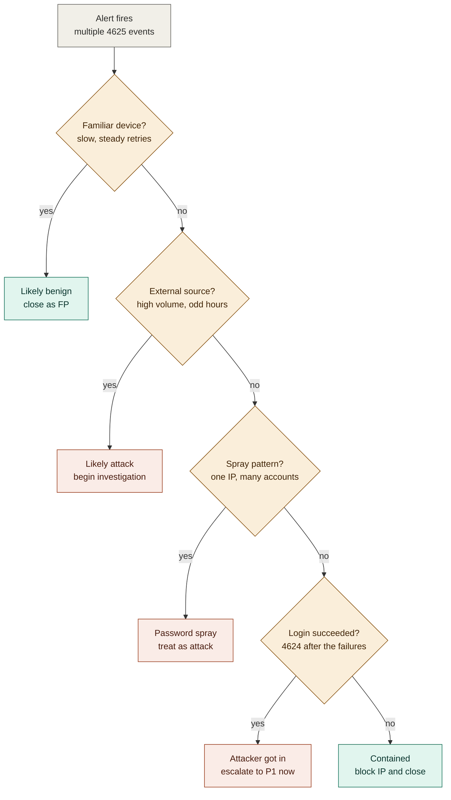
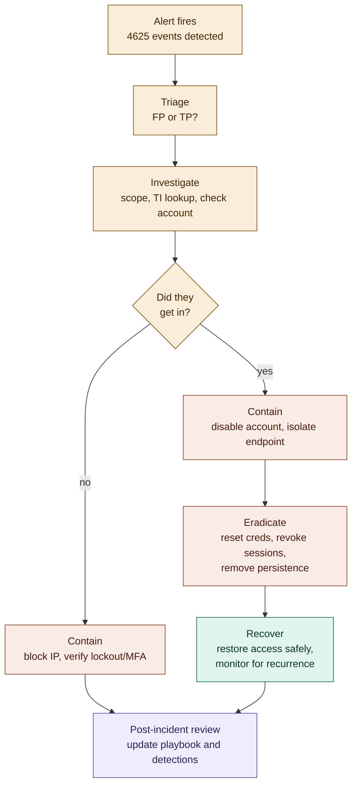

# Brute Force Attack - IR Playbook
> A complete, practical guide for SOC analysts - from detection to escalation.
> Based on real-world SOC experience across MSSPs, startups, and Fortune 500 companies.
> Written to be understandable by beginners — every technical term is explained the first time it's used.

---

## Start Here — What This Document Is, in Simple Terms

Imagine someone standing at your front door, trying key after key after key until one unlocks it. That's a **brute force attack** — except instead of a door, it's your work account, and instead of keys, it's passwords. A computer program can try thousands of passwords per minute, way faster than any person typing.

Every time someone tries to log in and gets it wrong, the computer writes that down automatically — this is called a **log**. Security teams watch these logs to spot when someone (or some program) is trying way more passwords than a normal person ever would.

**But here's the tricky part:** most of the time, when you see a bunch of failed logins, it's NOT an attacker — it's just an employee who forgot their password, or their phone still has the old password saved. This playbook's whole job is to teach you how to tell the difference between "just Bob forgetting his password again" and "someone is actually trying to break in" — and then exactly what to do about each one.

**The document is organized to build up gradually:**
1. First, a glossary of terms so nothing feels like alphabet soup
2. Then, what a brute force attack actually is and how it happens
3. Then, how to tell a real attack from an innocent mistake
4. Then, the exact technical steps to investigate and respond
5. And at the very end, one big flowchart that ties the entire response process together, start to finish

Read top to bottom the first time. After that, use it as a reference — jump straight to whatever section you need.

---

## Glossary — Read This First If You're New

| Term | Plain-English Meaning |
|---|---|
| **SIEM** | Security Information and Event Management — a tool (like Splunk or Microsoft Sentinel) that collects logs from every system in a company and lets analysts search them |
| **Log / Event** | A record a computer system writes automatically every time something happens (a login, a failed login, a file access, etc.) |
| **4625 / 4624** | Windows numbers for specific types of login events. 4625 = failed login. 4624 = successful login. Windows assigns every event type a fixed number so tools can search for them consistently |
| **IOC (Indicator of Compromise)** | A specific clue — like an IP address, file hash, or domain name — that suggests an attack happened |
| **TI (Threat Intelligence)** | Information about known bad IPs, domains, malware, and attacker behavior, usually pulled from external feeds |
| **ASN** | Autonomous System Number — identifies which company/ISP owns a block of IP addresses. Helps you tell "residential home internet" from "cloud hosting provider" from "known VPN service" |
| **MFA (Multi-Factor Authentication)** | Requiring a second proof of identity beyond just a password — like a phone app code or push notification |
| **Endpoint** | Any device a person uses — laptop, desktop, phone — as opposed to a server |
| **Lateral Movement** | Once an attacker gets into one machine, this is them moving to other machines on the same network |
| **Persistence** | Techniques an attacker uses to make sure they can get back in even if you close their first way in (e.g., scheduled tasks, new accounts) |
| **SPL** | Search Processing Language — the query language used in Splunk (a SIEM tool) |
| **KQL** | Kusto Query Language — the query language used in Microsoft Sentinel |
| **Sigma Rule** | A generic, tool-independent way to write a detection rule so it can be converted to run in Splunk, Sentinel, or other SIEMs |
| **P1 / P2** | Priority levels for incidents. P1 = highest urgency, drop everything. P2 = high but not "all hands" urgent |
| **IC (Incident Commander)** | The person who runs and coordinates the response once something is declared a real incident |
| **FP / TP** | False Positive (alert fired but nothing bad actually happened) / True Positive (alert fired and it's a real attack) |
| **CSF** | Cybersecurity Framework — NIST's high-level model for organizing all cybersecurity activity (see Section below) |

---

## What is a Brute Force Attack?
Attacker tries thousands of username/password combinations to break into an account. Simple, noisy, but still works because people use weak passwords.

**Common Types:**
- **Simple brute force** - try every possible combination
- **Dictionary attack** - use a wordlist (rockyou.txt, etc.)
- **Credential stuffing** - use leaked creds from breaches
- **Password spraying** - one password across many accounts (avoids lockout)

**Why "spraying" avoids lockout, in plain terms:** Most companies lock an account after ~5 wrong passwords *for that one account*. If an attacker tries 5 different passwords against 1,000 different accounts (1 attempt each), no single account ever hits the lockout threshold — but the attacker still gets a few hits, statistically, because some employees reuse common passwords like `Summer2026!`.

---

## MITRE ATT&CK Mapping
*MITRE ATT&CK is a public, widely-used catalog of attacker techniques. Analysts use it as a shared vocabulary — instead of describing an attack in a paragraph, you can just say "T1110.003" and every trained analyst instantly knows what you mean.*

| Technique ID | Name | Description |
|---|---|---|
| T1110 | Brute Force | Parent technique |
| T1110.001 | Password Guessing | Systematic guess attempts |
| T1110.002 | Password Cracking | Crack hashed credentials offline |
| T1110.003 | Password Spraying | One password across many accounts |
| T1110.004 | Credential Stuffing | Use leaked breached credentials |

### Full ATT&CK Kill Chain
*A "kill chain" is just the sequence of steps an attacker typically goes through, from getting in to achieving their goal. Knowing the chain tells you what to check for next once you've found one piece of it.*

| Phase | Technique | What to Look For |
|---|---|---|
| Initial Access | T1078 - Valid Accounts | Successful login after brute force |
| Credential Access | T1110 - Brute Force | Multiple 4625 events |
| Lateral Movement | T1021 - Remote Services | RDP/SMB from compromised host |
| Persistence | T1053 - Scheduled Task | New tasks created post-compromise |
| Defense Evasion | T1070 - Log Clearing | Security log wiped after access |

---

## NIST Framework Alignment

Two NIST documents are relevant here, and it's important to know which one applies to what:

### 1. NIST SP 800-61 — Incident Response Guidance
This is NIST's dedicated guidance for handling security incidents.

- **Revision 2** (2012, now retired as of April 2025) used a simple 4-phase lifecycle: **Preparation → Detection & Analysis → Containment/Eradication/Recovery → Post-Incident Activity**. This playbook was originally structured to follow that shape.
- **Revision 3** (current, published April 2025) replaced that lifecycle with a mapping to **NIST Cybersecurity Framework (CSF) 2.0's six functions**: Govern, Identify, Protect, Detect, Respond, Recover. Rev. 3 deliberately stopped being a prescriptive "how-to" document (technical steps change too fast to keep static), and instead tells organizations to build their own tactical playbooks — like this one — and align them to CSF 2.0 conceptually.

**In short: this playbook is the kind of tactical detail Rev. 3 expects *you* to write. The table below shows how each section maps to a CSF 2.0 function**, so the playbook is presentable in an audit or to leadership using current NIST terminology.

| CSF 2.0 Function | Plain-English Meaning | Where It Lives in This Playbook |
|---|---|---|
| **Govern** | Set policy — who owns this process, what's the escalation chain, what's "acceptable risk" | Escalation Criteria, Communication Template |
| **Identify** | Know your environment well enough to tell normal from abnormal | Glossary, Alert Sources, "How You'll See It" |
| **Protect** | Safeguards in place *before* an incident (lockout policy, MFA) that limit damage | Referenced in Containment ("verify MFA is enabled," "lockout policy working") |
| **Detect** | Actually notice something happened | Raw Log section, FP/TP indicators, Quick Decision Tree, Detection Rules (SPL/KQL/Sigma) |
| **Respond** | Act to contain and fix it | Investigation Steps, Containment, Escalation, Communication Template |
| **Recover** | Get back to normal safely | Password reset, session revocation, "Document and close as contained" |

**Where this playbook is currently thin, relative to Rev. 3 expectations:** a formal **Post-Incident Review / Lessons Learned** step. Rev. 3 puts heavy emphasis on continuous improvement — every incident (even false positives) should feed back into tuning detections and updating this exact document. See the new section near the end of this playbook.

### 2. NIST CSF 2.0 — The Bigger Picture
CSF 2.0 is NIST's overall framework for organizing *all* cybersecurity work, not just incident response — it also covers governance, asset management, risk assessment, etc. SP 800-61r3 (above) is essentially a "translation" of incident response practices into CSF 2.0's language, so IR fits cleanly into a company's broader security program instead of living in its own silo.

---

## How You'll See It — Alert Sources

| Source | What You'll See |
|---|---|
| SIEM (Splunk/Sentinel) | Multiple 4625 events from same source IP |
| CrowdStrike | "Brute Force Attempt" or "Multiple Failed Logins" detection |
| Azure AD / Entra ID | Risky sign-in, unfamiliar location |
| Firewall | Repeated connections to port 3389 (RDP), 22 (SSH), 443 (OWA) |
| Proofpoint/Email Gateway | Multiple failed O365 auth attempts |

---

## Raw Log — What It Looks Like

### Windows Event ID 4625 (Failed Logon)
```xml
<Event>
  <System>
    <EventID>4625</EventID>
    <TimeCreated SystemTime="2026-07-11T03:14:22.123Z"/>
  </System>
  <EventData>
    <Data Name="TargetUserName">jsmith</Data>
    <Data Name="TargetDomainName">CORP</Data>
    <Data Name="Status">0xC000006D</Data>
    <Data Name="SubStatus">0xC000006A</Data>
    <Data Name="IpAddress">185.220.101.45</Data>
    <Data Name="IpPort">49832</Data>
    <Data Name="LogonType">10</Data>
    <Data Name="WorkstationName">UNKNOWN</Data>
  </EventData>
</Event>
```
*If you've never seen a raw Windows event before: this is XML, a structured text format. Think of it like a form with labeled fields — you don't need to memorize XML syntax, just learn to spot the `Data Name="..."` fields, since those are the actual values that matter.*

**How to read this:**
- `EventID 4625` = failed logon
- `Status 0xC000006D` = bad username or password
- `SubStatus 0xC000006A` = wrong password (username exists)
- `LogonType 10` = Remote Desktop (RDP)
- `IpAddress` = where the attempt came from
- `WorkstationName UNKNOWN` = not a domain-joined machine = suspicious

---

## How to Read This Table

| Field | Meaning |
|---|---|
| EventID 4625 | Failed logon event |
| Status 0xC000006D | Bad username or password |
| SubStatus 0xC000006A | Wrong password (username exists) |
| LogonType 10 | Remote Desktop (RDP) |
| IpAddress | Where the attempt came from |
| WorkstationName UNKNOWN | Not a domain-joined machine — suspicious |

**Beginner note on `LogonType`:** Windows has about 10 logon types. The two you'll see constantly:
- `LogonType 2` = someone sitting physically at the keyboard (console)
- `LogonType 3` = access over the network (e.g., accessing a shared drive)
- `LogonType 10` = Remote Desktop (RDP)

A `LogonType 2` failure is almost always harmless (you're watching someone mistype their own password on their own machine). A `LogonType 10` failure from an unfamiliar IP is a much bigger red flag — someone is trying to remote into a machine from outside.

---

## True Positive vs False Positive
Not every brute force alert is an attack. Employees forget passwords all the time.

### Signs It's a FALSE POSITIVE (Legitimate User)

| Indicator | Why |
|---|---|
| Source IP is internal/VPN | Employee on corporate network |
| 3-5 failures then a success | Forgot password, tried a few times |
| Happens during business hours | Normal work pattern |
| User calls helpdesk around same time | They know they're locked out |
| LogonType 2 (Interactive/Console) | Sitting at their own machine |
| Account matches the workstation owner | It's their own device |
| SubStatus 0xC0000071 (password expired) | Password rotation issue |

### Signs It's a TRUE POSITIVE (Attack)

| Indicator | Why |
|---|---|
| Source IP is external/unknown geo | Not the employee |
| 100+ failures in minutes | No human types that fast |
| Happens at 2-4 AM | Nobody's working |
| Targets multiple accounts from same IP | Spraying |
| LogonType 10 (RDP) or 3 (Network) from outside | Remote attack |
| WorkstationName = UNKNOWN | Not a domain-joined machine |
| SubStatus 0xC000006A repeated 100x | Automated tool |
| Successful logon after failures from same IP | They got in |
| No helpdesk ticket from the user | User didn't do this |

---

## Quick Decision Tree

**Visual version** — follow the questions top to bottom; a "yes" branches right to the outcome. If a viewer doesn't render the diagram below, the same logic is written out as plain text/ASCII right after it.



**How to read it:** the amber diamonds are questions, asked in order. Any "yes" branches right to a result. The one rule that overrides everything else: even if earlier answers looked benign, a successful login (`4624`) after the failures always routes you to "Attacker got in — escalate to P1 now."

**Plain-text version of the same logic:**
```
Alert fires: Multiple 4625 events
|
|-- Source IP internal + < 10 attempts + business hours?
|   YES --> Likely forgot password. Check with user. Close as FP.
|
|-- Source IP external + > 20 attempts + odd hours?
|   YES --> Likely attack. Investigate immediately.
|
|-- One IP hitting MANY accounts?
|   YES --> Password spray. Treat as TP.
|
|-- Successful 4624 after the failures from same IP?
    YES --> Confirmed compromise. Escalate NOW.
```

---

## Real-World Examples

### Example 1 — False Positive
Monday 9:15 AM. User `jsmith` has 4 failed logins (4625) from IP `10.0.5.22` (their assigned workstation). Then a successful login (4624). SubStatus shows `0xC0000071` (expired password).

**Verdict:** Password expired over the weekend. They tried their old password a few times. Close as FP.

### Example 2 — True Positive
Saturday 3:22 AM. 847 failed logins (4625) for user `svc_backup` from IP `185.220.101.45` (Tor exit node). LogonType 10 (RDP). Then one successful login (4624) at 3:30 AM.

**Verdict:** Brute force attack succeeded. Disable account, isolate endpoint, escalate.

### Example 3 — Needs More Context
Tuesday 6 PM. User `admin_jones` has 15 failed logins from VPN IP. No success. User is remote worker in a different timezone.

**Verdict:** Could be either. Contact the user to verify. Check if their VPN session was active. If user confirms it wasn't them, treat as TP.

---

## Investigation Steps

### Step 1: Confirm It's Real
```spl
index=windows EventCode=4625
| stats count by src_ip, user, dest
| where count > 10
| sort -count
```
*What this query does, line by line: search the Windows log index for failed-login events → count how many happened per source IP / user / destination machine → keep only the groups with more than 10 → sort so the biggest numbers are on top.*

Ask yourself:
- Is it one IP hitting one account? --> Targeted brute force
- Is it one IP hitting many accounts? --> Password spraying
- Is it many IPs hitting one account? --> Distributed/botnet attack

### Step 2: Check if They Got In
```spl
index=windows EventCode=4624 src_ip="185.220.101.45"
| table _time, user, src_ip, LogonType, dest
```
If you see a **4624 (successful logon)** from the same IP after the failures — the attacker got in. Escalate immediately.

### Step 3: Threat Intel on Source IP
- Check in your TI platform (OpenCTI, VirusTotal, AbuseIPDB)
- Is it a known Tor exit node? VPN? Hosting provider?
- Geo-location — does it match where the user normally logs in?

### Step 4: Check the Target Account
- Is it a service account? Admin? Regular user?
- Is MFA enabled on this account?
- Has this user reported anything suspicious?

### Step 5: Scope the Attack
```spl
index=windows EventCode=4625 src_ip="185.220.101.45"
| stats count dc(user) as unique_users by src_ip
| table src_ip, count, unique_users
```
How many accounts did they try? One account = targeted. Many accounts = spray.

---

## Containment — What to Do

### If They Did NOT Get In:
1. Block the source IP at firewall/WAF
2. Verify account lockout policy is working
3. Confirm MFA is enabled on targeted accounts
4. Add IP to watchlist in SIEM
5. Document and close as contained

### If They DID Get In (4624 after 4625):
1. **Immediately disable the compromised account**
2. Isolate the endpoint (CrowdStrike → Network Contain)
3. Force password reset
4. Revoke all active sessions/tokens
5. Check for persistence:
   - New scheduled tasks?
   - New services installed?
   - Registry run keys modified?
   - Any lateral movement (4624 Type 3 from that host)?
6. Escalate to Incident Commander

---

## Detection Rules

### Splunk — Basic Brute Force
```spl
index=windows EventCode=4625
| bucket _time span=5m
| stats count by src_ip, user, _time
| where count > 20
```

### Splunk — Password Spray Detection
```spl
index=windows EventCode=4625
| bucket _time span=10m
| stats dc(user) as unique_users count by src_ip, _time
| where unique_users > 5 AND count > 20
```

### Splunk — Brute Force Followed by Success
```spl
index=windows (EventCode=4625 OR EventCode=4624)
| transaction src_ip maxspan=30m
| where eventcount > 10 AND EventCode=4624
| table _time, src_ip, user, dest
```

### KQL (Microsoft Sentinel) — Brute Force
```kql
SecurityEvent
| where EventID == 4625
| summarize FailedAttempts = count() by SourceIP = IpAddress, TargetAccount = TargetUserName, bin(TimeGenerated, 5m)
| where FailedAttempts > 20
```

### Sigma Rule
```yaml
title: Brute Force - Multiple Failed Logons
id: 1a2b3c4d-5e6f-7890-abcd-ef1234567890
status: experimental
logsource:
  product: windows
  service: security
detection:
  selection:
    EventID: 4625
  condition: selection | count(TargetUserName) by IpAddress > 20
  timeframe: 5m
level: medium
tags:
  - attack.credential_access
  - attack.t1110
```

---

## Common Mistakes Analysts Make

| Mistake | Why It Matters |
|---|---|
| Closing alert because account locked out | Attacker might try another account or already succeeded |
| Not checking if a successful login followed | 4624 after 4625 = compromise |
| Ignoring LogonType | Type 10 = RDP from outside is far worse than Type 2 = local |
| Not checking if source IP hit other accounts | Could be a spray attack targeting the whole org |
| Forgetting to check for lateral movement | Attacker may have already moved to other systems |

---

## Escalation Criteria

Escalate to P1 / Incident Commander if ANY of the following are true:
- Successful logon confirmed after brute force (4624 from attacker IP)
- Target is a privileged account (admin, service account, domain admin)
- Multiple accounts compromised
- Evidence of lateral movement post-compromise
- Source is internal IP (could mean attacker already inside the network)

---

## Communication Template

**To:** SOC Manager / Incident Commander

**Subject:** [P2] Brute Force Attack — Successful Compromise Detected

```
Summary: Multiple failed logon attempts (4625) detected from IP 185.220.101.45
targeting user jsmith@corp.com via RDP. A successful logon (4624) was observed
at 03:22 UTC following 847 failed attempts over 8 minutes.

Actions Taken:
- Account disabled
- Endpoint isolated via CrowdStrike
- Source IP blocked at perimeter firewall
- Password reset initiated

Next Steps:
- Forensic review of endpoint for persistence
- Check for lateral movement
- Awaiting TI enrichment on source IP
```

---

## Post-Incident Review / Lessons Learned
*This is the step most playbooks skip — and the one NIST SP 800-61 Rev. 3 emphasizes most. Every incident, even a false positive, is a free lesson about your environment. Skipping this step means you solve the same problem manually every single time instead of getting faster.*

Do this **within a few days** of closing any P1/P2 incident, and periodically for recurring false positives:

1. **Timeline reconstruction** — When did the first failed login happen? When was it detected? When did response start? When was it contained? (This gives you Mean Time to Detect and Mean Time to Respond — useful metrics to show improvement over time.)
2. **What worked** — Which detection rule caught it? Was the alert routed to the right queue?
3. **What didn't work** — Was there a delay? Did the analyst have to manually check things that could've been automated? Did the runbook have a gap (like this one didn't originally address employee lockouts)?
4. **Update the playbook** — If you learned something new (like a false-positive pattern, or a detection gap), edit this document immediately. Don't wait for a scheduled review.
5. **Update detection rules** — If the incident revealed a blind spot (e.g., distributed spray evading the per-IP threshold), tune the SPL/KQL/Sigma rules above.
6. **Track recurring false positives** — If the same user keeps triggering "forgot password" alerts, that's not a security problem, it's a training/tooling problem (password manager, MDM credential sync) — route it to IT, not the SOC queue.
7. **Share with the team** — A 5-minute writeup or a few minutes in the next team sync beats a stack of unread postmortems.

**Simple template:**
```
Incident: [brief title]
Date/Time detected: 
Date/Time contained: 
Root cause: 
What worked: 
What we're changing: 
Playbook/detection updates made: 
```

---

## Practice Challenge

**Scenario:** You see this in Splunk at 2 AM:
- 1,200 Event ID 4625 from IP `91.240.118.72` in 10 minutes
- All targeting different accounts in the CORP domain
- LogonType = 3 (Network)
- Then one Event ID 4624 for user `svc_backup` from same IP

**Questions:**
1. What type of brute force is this?
2. What's your first action?
3. Why is `svc_backup` being compromised especially dangerous?
4. What do you check next on the endpoint?
5. What's your escalation path?

**Answers:**
1. Password spraying (many accounts, one IP)
2. Disable `svc_backup` account immediately + isolate endpoint
3. Service accounts often have elevated privileges and no MFA
4. Check for scheduled tasks, new services, lateral movement (4624 Type 3 from that host to others)
5. P1 escalation — privileged account compromised via spray attack

---

## The Full Incident Response Playbook — End-to-End Flowchart

Everything above walks through the details step by step. This is the whole thing pulled together into one picture — start to finish, in order. Each stage is tagged with which **NIST CSF 2.0 function** it belongs to (see the NIST Framework Alignment section above), so this same diagram doubles as your audit-ready process map.



**Reading the color coding (matches CSF 2.0 functions):**

| Color | CSF Function | Stages |
|---|---|---|
| Amber | Detect | Alert fires → Triage → Investigate → Did they get in? |
| Coral | Respond | Contain → Eradicate |
| Teal | Recover | Restore access, monitor |
| Purple | Identify / Improve | Post-incident review |

**In plain words, top to bottom:**
1. **Alert fires** — the SIEM or CrowdStrike flags a burst of failed logins
2. **Triage** — is this a real attack or just an employee locked out? (This is the whole "Quick Decision Tree" flowchart from earlier — it lives inside this one step)
3. **Investigate** — figure out how big the problem is: one account or many, one IP or a botnet, threat intel on the source
4. **Did they get in?** — the single most important question. A `4624` success after the failures changes everything
5. **If no** → contain lightly (block the IP, confirm lockout/MFA worked) and you're basically done
6. **If yes** → contain hard (disable the account, isolate the machine), then **eradicate** (reset passwords, revoke sessions, hunt for anything the attacker left behind), then **recover** (bring the user back online safely and keep watching)
7. **Post-incident review** — every single case, benign or malicious, feeds back into making the playbook and detection rules better next time. This step is why the playbook keeps improving instead of staying the same forever.

Govern, Identify, and Protect (the other three CSF functions) aren't drawn as boxes in this flow because they're not something you do *during* an incident — they're the ongoing work that happens before one ever occurs: writing this playbook, setting the lockout policy, enabling MFA, deciding who your Incident Commander is. They're the foundation the whole flowchart stands on.